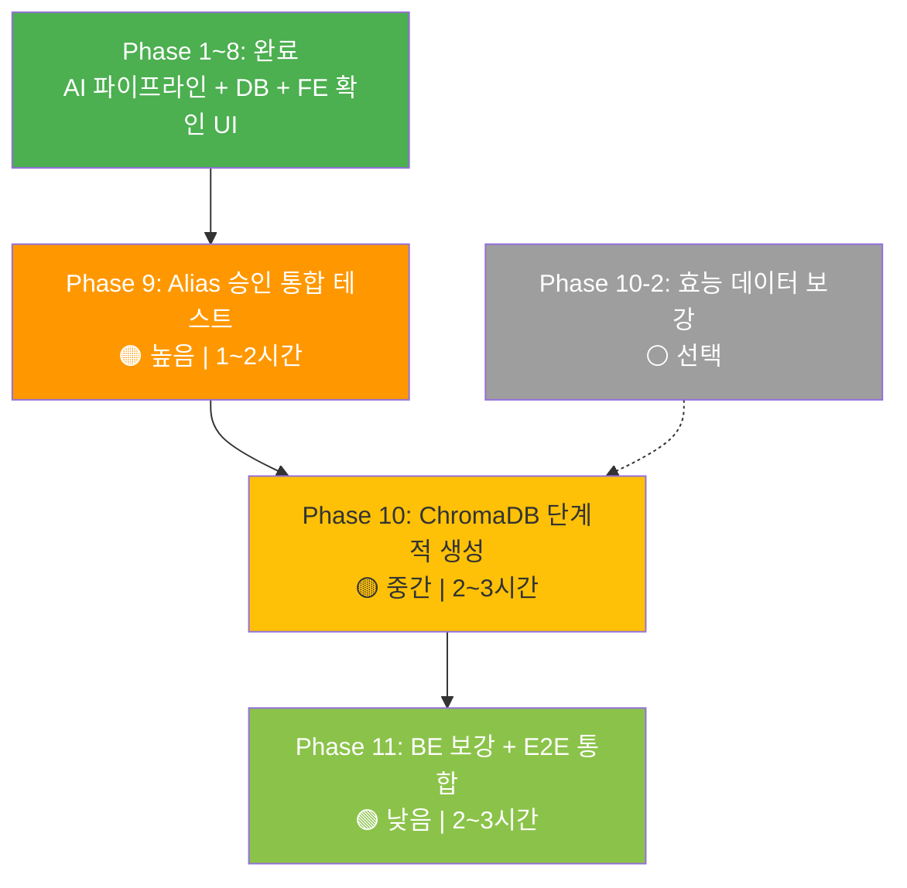

# OCR 복약관리 — 향후 과제 로드맵

> **기준일**: 2026-04-28
> **환경**: 로컬 MySQL (127.0.0.1:3306 / silverlink)
> **API**: DrugPrdtPrmsnInfoService07 (의약품 허가정보)

---

## 현재 완료 상태

| 영역 | 상태 | 비고 |
|------|------|------|
| AI 파이프라인 (Phase 1~6) | ✅ | `tests/unit_tests`: 37 passed, 0 failed |
| DB 스키마 (`schema.sql`) | ✅ | `medications_master` 26개 컬럼, `medication%` 테이블 10개 |
| AI API 엔드포인트 | ✅ | `validate-medication`, `confirm-medication`, `pending-confirmations` |
| FE OCR 페이지 | ✅ | `SeniorOCR.tsx` — confirm 모달 + 새 API 필드 표시 |
| FE Dashboard 배지 | ✅ | `SeniorDashboard.tsx` — 미확인 건수 배지 |
| 약품 마스터 데이터 | ✅ | `medications_master` 43,293건 (활성 35,291 / 취소 8,002) |
| Alias 데이터 | ✅ | `medication_aliases` 94,737건, `medication_error_aliases` 86,715건 |
| 관리자 Alias 승인 | ✅ 코드 | AI/BE/FE 코드 신설 완료, E2E 통합 테스트 미완 |

> [!NOTE]
> 루트의 `test_ocr_validation.py`는 구버전 `medication_validator` 모듈을 참조하므로 현재 검증 기준에서 제외합니다.
> 현재 유효한 테스트 기준은 `AI/SilverLink-AI/tests/unit_tests`입니다.

---

## Phase 7: 로컬 DB 초기 구축 + 새 API 전환 ✅ 완료

> **상태**: ✅ 완료
> **API**: `DrbEasyDrugInfoService` → `DrugPrdtPrmsnInfoService07` 전환 완료

### 7-1. API 전환 요약

| 항목 | Before | After |
|------|--------|-------|
| API | DrbEasyDrugInfoService (e약은요) | DrugPrdtPrmsnInfoService07 (허가정보) |
| 데이터 건수 | 4,688건 | **43,293건** |
| DrugInfo 필드 | 13개 | **24개** (is_active 포함) |
| 응답 필드 형식 | camelCase | UPPER_CASE |
| 효능 정보 | efcy_qesitm 있음 | 없음 (성분명 fallback) |

### 7-2. 수정 파일

| 파일 | 변경 내용 |
|------|-----------|
| `schema.sql` | 신규 11개 컬럼 + is_active + VARCHAR 확대 |
| `config.py` | DRUG_API_ENDPOINT 환경변수 추가 |
| `drug_model.py` | DrugInfo 24개 필드 |
| `drug_api_client.py` | 신규 API 엔드포인트/파라미터 전환 |
| `drug_repository.py` | UPSERT/SELECT 수정, is_active=1 필터 5곳 |
| `load_drug_data.py` | UPPER_CASE 매핑, CANCEL_DATE → is_active=0 |
| `llm_descriptor.py` | 성분명 fallback 안내 (추론용 아님) |

### 7-3. 적재 결과

```
medications_master: 43,293건 (활성 35,291 / 취소 8,002)
medication_aliases: 94,737건
medication_error_aliases: 86,715건
ChromaDB: 정책 P3에 따라 스킵 (Phase 10에서 단계적 생성)
```

### 7-4. 정책 반영

| # | 정책 | 반영 |
|---|------|------|
| P1 | 전체 초기화 후 재적재 | ✅ 7개 테이블 DROP+CREATE |
| P2 | OCR 로그 함께 초기화 | ✅ |
| P3 | ChromaDB 즉시 수행 않음 | ✅ 스킵 |
| P4 | CANCEL_DATE → is_active=0 | ✅ 8,002건 |
| P5 | item_ingr_name 안내 fallback만 | ✅ |
| P6 | SELECT에 is_active=1 필터 | ✅ 5곳 |
| P7 | schema.sql ↔ repository 컬럼 일치 | ✅ 26개 |

---

## Phase 8: FE 사용자 확인 UI ✅ 완료

> **상태**: ✅ 완료
> **FE 빌드**: `npm run build` 성공

### 구현 내용

#### 8-1. SeniorOCR.tsx — confirm 흐름

```
OCR → Luxia → AI 검증 → 확인 모달(후보 선택) → confirmMedication API → 복약 등록
```

- `submitMedicationConfirmation()`: confirm API 호출 (`request_id` + `selected_item_seq`)
- `showConfirmDialog`: 후보 선택 모달 (라디오 UI)
- "맞아요" → `confirmed=true` → 복약 등록 다이얼로그
- "아니요" → `confirmed=false` → 리셋

#### 8-2. 새 API 필드 표시 (Phase 7 연동)

- 후보 카드: **성분명** (`item_ingr_name`), **전문/일반** (`spclty_pblc`), **업체명** (`entp_name`) 표시
- 확인 모달: 동일 정보 표시
- purpose fallback: `efcy_qesitm` 없으면 `"성분: {item_ingr_name}"` 표시

#### 8-3. SeniorDashboard 미확인 배지

```tsx
// OCR 카드에 "확인할 약 N건" 배지
useEffect → getPendingConfirmations(user.id) → pendingOcrCount
```

#### 8-4. ocr.ts API 모듈

| 함수 | 경로 | 설명 |
|------|------|------|
| `validateMedicationOCR` | `POST /api/ocr/validate-medication` | AI 검증 |
| `confirmMedication` | `POST /api/ocr/confirm-medication` | 후보 확정/거부 |
| `getPendingConfirmations` | `GET /api/ocr/pending-confirmations/{id}` | 미확인 목록 |

#### 8-5. 타입 보강

`MedicationCandidate` + `MedicationInfo`에 추가:
- `item_ingr_name?: string` (주성분명)
- `spclty_pblc?: string` (전문/일반 구분)
- `prduct_type?: string` (제품 유형)
- `purpose?: string` (효능 또는 성분명 fallback)

---

## Phase 9: 관리자 Alias 승인 — 통합 검증 필요

> **우선순위**: 🟠 높음
> **예상 소요**: 1~2시간
> **상태**: 코드 완료, E2E 통합 테스트 미완

### 현재 상태

```
✅ AI: alias_suggestion_repository.py + ocr.py 관리자 API 4종
✅ BE: AdminAliasController.java 프록시 컨트롤러
✅ FE: AliasManagement.tsx + aliasAdmin.ts + 라우트/메뉴 등록
❌ 통합 테스트 미완: BE 빌드 (JAVA_HOME 미설정), 실제 E2E 흐름
```

### 9-1. BE 빌드 환경 해결

```bash
# JAVA_HOME 설정 후 BE 컴파일 확인
set JAVA_HOME=C:\Program Files\Java\jdk-17
cd BE\SilverLink-BE
.\gradlew.bat compileJava
```

### 9-2. E2E 통합 테스트

1. AI 서버 기동 → `GET /api/ocr/admin/alias-suggestions` 정상 응답
2. BE 서버 기동 → BE 프록시 경유 동일 호출
3. FE `/admin/alias-management` 접속 → PENDING 목록 표시
4. 승인 → `medication_aliases` INSERT 확인 + LocalDrugIndex reload
5. 거부 → `review_status=REJECTED` 확인

### 9-3. Phase 8과의 연결 확인

- Phase 8에서 사용자가 약 확정/거부 시 → alias suggestion 생성 확인
- 관리자 승인 시 → 다음 OCR에서 해당 alias 자동 매칭 확인

---

## Phase 10: 데이터 파이프라인 안정화

> **우선순위**: 🟡 중간
> **예상 소요**: 2~3시간

### 10-1. ChromaDB 단계적 생성 (정책 P3)

```
단계 1: MySQL + LocalDrugIndex 기반 OCR 검증 정상 동작 확인 ← Phase 9 후
단계 2: 활성 약품(is_active=1) 35,291건만 ChromaDB 임베딩 생성
단계 3: OCR 파이프라인 VectorDB fallback 포함 재검증
```

구현:
- `scripts/load_drug_data.py`에 `--chromadb-only` 옵션 추가
- `WHERE is_active = 1` 기준으로 ChromaDB 적재
- OpenAI Embedding API 비용 예측: ~35K건 × ~$0.0001/건 ≈ **$3.5**

### 10-2. e약은요 효능 데이터 보강 (선택)

새 API에는 `efcy_qesitm`(효능), `use_method_qesitm`(용법) 등이 없음.

| 방법 | 설명 | 비용 |
|------|------|------|
| A. 구형 API 병행 호출 | DrbEasyDrugInfoService에서 efcy 등 가져와 UPDATE | ~4,700건 |
| B. 현행 유지 | item_ingr_name fallback으로 충분하면 불필요 | 없음 |

### 10-3. 적재 자동화

```bash
# 주기적 갱신 스크립트
python -m scripts.load_drug_data            # API → MySQL
python -m scripts.seed_aliases              # alias 재생성
python -m scripts.load_drug_data --chromadb-only  # ChromaDB 갱신
```

---

## Phase 11: Spring Boot BE 프록시 보강 + 통합 테스트

> **우선순위**: 🟢 낮음
> **예상 소요**: 2~3시간

### 11-1. 보강 포인트

| 항목 | 현재 | 목표 |
|------|------|------|
| validate-medication | ✅ 있음 | JWT 인증 추가 |
| confirm-medication | ✅ 있음 | 권한 체크 (본인 확인) |
| pending-confirmations | ✅ 있음 | GET 프록시 확인 |
| reload-dictionary | ❌ 없음 | 관리자 전용 프록시 추가 |

### 11-2. E2E 전체 시나리오

```
1. [FE] SeniorOCR → 사진 촬영 → Luxia OCR
2. [FE→BE] POST /api/ocr/validate-medication
3. [BE→AI] 프록시 → AI 파이프라인 실행
4. [AI→BE→FE] 결과 반환 (request_id, candidates, decision)
5. [FE] 후보 확인 모달 → 사용자 선택
6. [FE→BE→AI] POST /api/ocr/confirm-medication
7. [AI] alias_suggestion 생성 + ocr_result 업데이트
8. [FE] 복약 일정 등록 (medication_schedules)
9. [관리자] alias 승인 → LocalDrugIndex reload
10. [다음 OCR] 승인된 alias로 자동 매칭
```

---

## 실행 순서 요약



---

## DB 접속 정보 (로컬)

| 항목 | 값 |
|------|---|
| Host | `127.0.0.1` (localhost) |
| Port | `3306` |
| Database | `silverlink` |
| User | `root` |
| Charset | `utf8mb4` |
| Collation | `utf8mb4_unicode_ci` |

### AI `.env` 설정

```env
RDS_HOST=localhost
RDS_PORT=3306
RDS_USER=root
RDS_PASSWORD=<비밀번호>
RDS_DATABASE=silverlink
DRUG_API_ENDPOINT=https://apis.data.go.kr/1471000/DrugPrdtPrmsnInfoService07/getDrugPrdtPrmsnInq07
```

### 주요 수치

| 항목 | 값 |
|------|------|
| medications_master | **43,293건** (활성 35,291 + 취소 8,002) |
| medication_aliases | **94,737건** |
| medication_error_aliases | **86,715건** |
| ChromaDB | ⏸️ 미생성 (정책 P3) |
| DrugInfo 필드 | 24개 |
| 단위 테스트 | 37 passed / 0 failed |
| FE 빌드 | ✅ 성공 (11s) |
