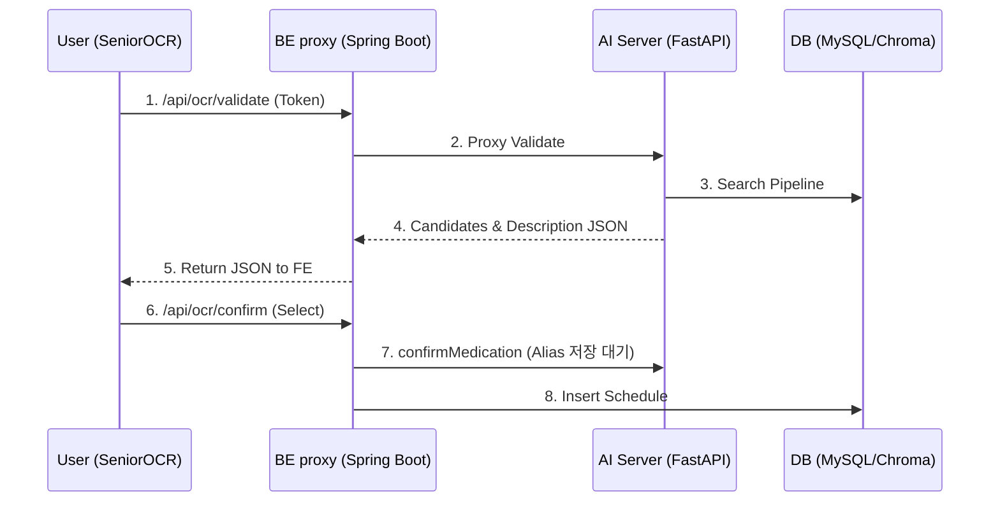
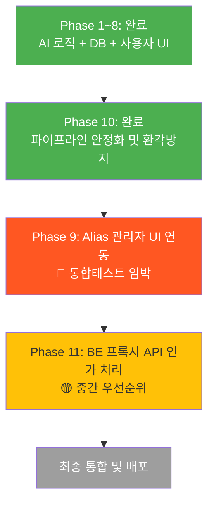

# OCR 복약관리 — 향후 과제 로드맵

> **기준일**: 2026-04-28
> **환경**: 로컬 MySQL (127.0.0.1:3306 / silverlink), ChromaDB
> **API**: DrugPrdtPrmsnInfoService07 (의약품 허가정보)

---

## 현재 완료 상태

| 영역 | 상태 | 비고 |
|------|------|------|
| AI 파이프라인 (Phase 1~6) | ✅ | `tests/unit_tests`: 37 passed, 0 failed |
| DB 스키마 (`schema.sql`) | ✅ | `medications_master` 26개 컬럼, `medication%` 테이블 10개 |
| AI API 엔드포인트 | ✅ | `validate-medication`, `confirm-medication`, `pending-confirmations` |
| 데이터 파이프라인 (Phase 10) | ✅ | `--chromadb-only` 분리 적재 및 LLM 효능 환각 방지 적용 |
| 관리자 자동화 스크립트 | ✅ | `run_phase10_pipeline.bat` 및 문서화 |
| FE OCR 페이지 | ✅ | `SeniorOCR.tsx` — confirm 모달 + 새 API 필드 표시 |
| FE Dashboard 배지 | ✅ | `SeniorDashboard.tsx` — 미확인 건수 배지 |
| 약품 마스터 데이터 | ✅ | `medications_master` 활성 35K건 로딩 완료 |
| Alias 데이터 | ✅ | `seed_aliases.py` (--force) 가드 적용 |

---

## Phase 7: 로컬 DB 초기 구축 + 새 API 전환 ✅ 완료

> **상태**: ✅ 완료
> **API**: `DrbEasyDrugInfoService` → `DrugPrdtPrmsnInfoService07` 전환 완료

### 7-1. 적재 결과 (Phase 10 보강 포함)

```
medications_master: 43,293건 (활성 35,291 / 취소 8,002)
medication_aliases: 94,737건
medication_error_aliases: 86,715건
ChromaDB: 약 35,291건 활성 약품 임베딩 적재 완료
```

---

## Phase 8: FE 사용자 확인 UI ✅ 완료

> **상태**: ✅ 완료

#### 8-1. SeniorOCR.tsx — confirm 흐름
```
OCR → Luxia → AI 검증 → 확인 모달(후보 선택) → confirmMedication API → 복약 등록
```
#### 8-2. ocr.ts API 모듈
| 함수 | 경로 | 설명 |
|------|------|------|
| `validateMedicationOCR` | `POST /api/ocr/validate-medication` | AI 검증 |
| `confirmMedication` | `POST /api/ocr/confirm-medication` | 후보 확정/거부 |
| `getPendingConfirmations` | `GET /api/ocr/pending-confirmations/{id}` | 미확인 목록 |

---

## Phase 10: 데이터 파이프라인 안정화 ✅ 완료

> **상태**: ✅ 완료
> **핵심 과제**: e약은요 서비스 종료에 대비한 데이터 소스 일원화 및 벡터 인덱싱 분리.

### 10-1. 구현 내역 요약
1. **API Client 및 Repository 고도화**
   - 24개 컬럼 대응을 위한 `medications_master` 테이블 구조 확장 및 `bulk_upsert` 통합 적용.
   - `CANCEL_DATE` 여부에 따른 `is_active` 분리 조건 강화.
2. **백그라운드 ChromaDB 분리**
   - `load_drug_data.py --chromadb-only` 플래그를 도입하여, MySQL과 독립적으로 임베딩 재생성이 가능하도록 개선.
3. **LLM 효능 환각(Hallucination) 영구 차단**
   - 새 허가정보 API에 존재하지 않는 `efcy_qesitm`(효능 정보)를 LLM이 마음대로 유추하지 않도록 `llm_descriptor.py` 프롬프트 안전 구문(Fallback) 추가.
4. **운영 파이프라인 자동화**
   - `run_phase10_pipeline.bat` 및 `docs/drug_data_pipeline.md` 배포를 통해 즉각적인 Dictionary 갱신 편의성 확대.

---

## 향후 진행 과제 (Next Steps)

## Phase 9: 관리자 Alias 승인 통합 검증

> **우선순위**: 🔴 매우 높음 (현재 즉시 테스트 필요)
> **상태**: AI/BE/FE 코드 구비 완료. **E2E 통합 테스트 검증만 남음.**

### 9-1. BE 컴파일 & 실행
```bash
set JAVA_HOME=C:\Program Files\Java\jdk-17
cd BE\SilverLink-BE
.\gradlew.bat bootRun
```
*주의사항: Spring Boot 내부 Proxy 라우터(`AdminAliasController.java`)의 컴파일 에러 유무 확인 및 JwtToken 기반 Role 체크 동작 확인.*

### 9-2. E2E 시나리오 검증 목록
- [ ] FE에서 관리자 계정 로그인 후 `/admin/alias-management` 접근 (인가 테스트)
- [ ] BE 프록시를 통해 AI `GET /admin/alias-suggestions`가 호출되고 PENDING 목록 렌더링 검증.
- [ ] 특정 Alias에 대해 **"승인(Approve)"** 처리 후:
   - `medication_aliases` INSERT 정상 여부 체크.
   - AI 레벨의 Memory Dictionary가 Atomic Swap으로 재시작 없이 로딩되는지 확인 (`/admin/reload-dictionary`).

---

## Phase 11: Spring Boot BE 프록시 엔드포인트 보강

> **우선순위**: 🟡 중간 

### 11-1. 보강 스펙 점검 (BE 컨트롤러 작업)
현재 OCR 추론 과정에서 AI 서버를 Client(FE)가 다이렉트로 호출하는 구조라면 보안/토큰 관리에 취약합니다. 모든 통신을 Spring Boot BE를 거쳐가도록 프록시를 보완합니다.

| 엔드포인트 | 변경 사항 (목표) | 인증 / 인가 상태 |
|------------|------------------|------------------|
| `/api/ocr/validate-medication` | FE → BE → AI 파일/텍스트 프록시 | 일반 User |
| `/api/ocr/confirm-medication` | FE → BE → AI 상태 프록시 | 일반 User |
| `/api/ocr/pending-confirmations`| FE → BE → DB/AI 조회 | 일반 User (본인 소유 검증) |
| `/api/ocr/admin/reload-dictionary` | FE(Admin) → BE → AI 명령어 전달 | **ADMIN Only** |

### 11-2. 데이터 흐름(E2E) 최종본


---

## 전체 진행 현황 



