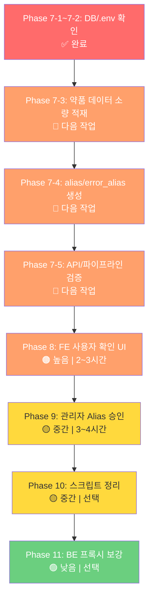

# OCR 복약관리 — 향후 과제 로드맵

> **기준일**: 2026-04-28  
> **환경**: 로컬 MySQL (127.0.0.1:3306 / silverlink)

---

## 현재 완료 상태

| 영역 | 상태 | 비고 |
|------|------|------|
| AI 파이프라인 (Phase 1~6) | ✅ | `tests/unit_tests`: 37 passed, 2 skipped |
| DB 스키마 (`schema.sql`) | ✅ | 로컬 MySQL 접속 성공, `medication%` 테이블 11개 확인 |
| AI API 엔드포인트 | ✅ | `validate-medication`, `confirm-medication`, `pending-confirmations` |
| FE OCR 페이지 | ✅ | `SeniorOCR.tsx` (44KB) |
| 약품 마스터 데이터 | ✅ | `medications_master` 4,688건, ChromaDB 4,688건 |
| Alias 데이터 | ✅ | `medication_aliases` 6,640건, `medication_error_aliases` 2,257건 |

> [!NOTE]
> 루트의 `test_ocr_validation.py`는 구버전 `medication_validator` 모듈을 참조하므로 현재 검증 기준에서 제외합니다.
> 현재 유효한 테스트 기준은 `AI/SilverLink-AI/tests/unit_tests`입니다.

---

## Phase 7: 로컬 DB 초기 구축

> **우선순위**: 🔴 최우선 (다른 모든 작업의 전제조건)  
> **예상 소요**: 30분  
> **현재 상태**: 완료

### 7-1. MySQL 테이블 생성

```bash
# 로컬 MySQL에 schema.sql 실행
mysql -u root -p silverlink < BE/SilverLink-BE/schema.sql
```

> [!IMPORTANT]
> `schema.sql`은 `IF NOT EXISTS`를 사용하므로 기존 테이블이 있어도 안전합니다.  
> 단, 컬럼 변경이 있는 경우 기존 테이블을 DROP 후 재실행해야 합니다.

### 7-2. AI `.env` 설정 확인

```env
# AI/SilverLink-AI/.env
RDS_HOST=localhost
RDS_PORT=3306
RDS_USER=root
RDS_PASSWORD=<your_password>
RDS_DATABASE=silverlink
```

확인 완료:
- `.env`에 RDS 접속값 설정됨
- `silverlink` DB 접속 성공
- `medication%` 테이블 11개 확인됨

### 7-3. e약은요 API 약품 데이터 적재

완료 결과:
- API 응답 누적: 4,704건
- `medications_master`: 4,688건
- ChromaDB `drug_embeddings`: 4,688건
- 진행 상태: `scripts/.load_progress.json` 기준 `last_page=48`

```bash
cd AI/SilverLink-AI

# 1. 먼저 소량 적재 테스트
.\.venv\Scripts\python.exe -m scripts.load_drug_data --max-pages 5

# 2. medications_master 적재 건수 확인
mysql -u root -p -e "USE silverlink; SELECT COUNT(*) FROM medications_master;"

# 3. 소량 적재가 정상이라면 전체 또는 제한 페이지로 확장
.\.venv\Scripts\python.exe -m scripts.load_drug_data --resume
```

> [!NOTE]
> 현재 약품 적재 스크립트는 `scripts/load_drug_data.py`입니다.  
> 기존 로드맵의 `scripts.seed_medications`는 현재 파일명과 맞지 않습니다.

### 7-4. alias/error_alias 생성

완료 결과:
- `medication_aliases`: 6,640건
- `medication_error_aliases`: 2,257건
- `scripts/seed_aliases.py`는 현재 `RDS_*` 설정명을 사용하도록 수정됨

```bash
cd AI/SilverLink-AI
.\.venv\Scripts\python.exe -m scripts.seed_aliases
```

확인:

```bash
mysql -u root -p -e "USE silverlink; SELECT COUNT(*) FROM medication_aliases;"
mysql -u root -p -e "USE silverlink; SELECT COUNT(*) FROM medication_error_aliases;"
```

### 7-5. AI 파이프라인 검증

완료 결과:
- `tests/unit_tests`: 37 passed, 2 skipped
- `POST /api/ocr/validate-medication` 테스트 성공
- 테스트 입력 `페니라민정` → `MATCHED`, `item_seq=196000011`, `request_id` 저장 성공

```bash
# 테이블 생성 확인
mysql -u root -p -e "USE silverlink; SHOW TABLES LIKE 'medication%';"

# 약품 데이터 확인
mysql -u root -p -e "USE silverlink; SELECT COUNT(*) FROM medications_master;"

# 단위 테스트
cd AI/SilverLink-AI
.\.venv\Scripts\python.exe -m pytest tests/unit_tests -q

# AI 서버 기동 후 API 테스트
.\.venv\Scripts\uvicorn.exe app.main:app --reload --port 8000
# POST http://localhost:8000/api/ocr/validate-medication
```

---

## Phase 8: FE 사용자 확인 UI

> **우선순위**: 🟠 높음  
> **예상 소요**: 4~6시간  
> **관련 파일**:
> - `BE/SilverLink-BE/src/main/java/com/aicc/silverlink/domain/ocr/controller/OcrProxyController.java`
> - `BE/SilverLink-BE/src/main/java/com/aicc/silverlink/domain/ocr/dto/OcrValidationResponse.java`
> - `FE/SilverLink-FE/src/api/ocr.ts`
> - `FE/SilverLink-FE/src/pages/senior/SeniorOCR.tsx`
> - `FE/SilverLink-FE/src/pages/senior/SeniorDashboard.tsx`
> - `FE/SilverLink-FE/src/pages/senior/SeniorMedication.tsx`

### 현재 상태
- `SeniorOCR.tsx`에 OCR 촬영, 이미지 압축, Luxia OCR 호출, AI 검증 결과 표시 UI가 이미 존재
- `decision_status`, `match_confidence`, `requires_user_confirmation`, `decision_reasons` 표시 일부 구현됨
- `SeniorMedication.tsx`에도 별도 OCR 촬영/확인 모달이 있으나 구형 텍스트 파싱 중심 흐름임
- `SeniorDashboard.tsx`에는 OCR 진입 카드만 있고 미확인 건수 배지는 없음

### 현재 차단점
- BE `OcrValidationResponse`에 Python AI 응답의 `request_id` 필드가 없어 FE가 확정/거부 API를 호출할 수 없음
- Spring Boot `OcrProxyController`에는 `validate-medication` 프록시만 있고 `confirm-medication`, `pending-confirmations` 프록시가 없음
- FE `src/api/ocr.ts`에는 `document-ai`만 있고 AI 검증/확정/미확인 목록 API 래퍼가 없음
- `SeniorOCR.tsx`는 후보를 보여주지만 `item_seq` 후보 선택 후 `confirm-medication`을 호출하지 않음
- `SeniorMedication.tsx`의 OCR 흐름은 Phase 8 신규 AI 판정 흐름과 중복되어 통합 방향 결정 필요

### 구현 원칙
- FE는 Spring Boot baseURL(`localhost:8080`)만 호출한다.
- Python AI 직접 호출은 Spring Boot 프록시 뒤로 숨긴다.
- OCR 결과 저장/확정의 기준 식별자는 Python AI가 반환하는 `request_id`로 통일한다.
- `MATCHED`도 사용자가 거부하거나 다른 후보를 선택할 수 있게 하되, `AMBIGUOUS`, `LOW_CONFIDENCE`, `NEED_USER_CONFIRMATION`은 확인 모달을 필수로 띄운다.

### 구현 필요 사항

#### 8-1. BE DTO 보강

`OcrValidationResponse`에 `request_id`를 추가한다.

```java
@JsonProperty("request_id")
private String requestId;
```

확인 포인트:
- `POST /api/ocr/validate-medication` 응답에 `request_id`가 포함되어야 함
- FE 타입에서는 `request_id?: string`으로 받음

#### 8-2. BE OCR 프록시 추가

`OcrProxyController`에 아래 엔드포인트를 추가한다.

| 메서드 | Spring Boot 경로 | Python AI 경로 | 설명 |
|--------|------------------|----------------|------|
| `POST` | `/api/ocr/confirm-medication` | `/api/ocr/confirm-medication` | 사용자가 후보 확정/거부 |
| `GET` | `/api/ocr/pending-confirmations/{elderlyUserId}` | `/api/ocr/pending-confirmations/{elderly_user_id}` | 미확인 OCR 목록 조회 |

추가 DTO:
- `ConfirmMedicationRequest`
- `ConfirmMedicationResponse`
- `PendingConfirmationItem`

요청 페이로드:

```json
{
  "requestId": "uuid-from-ocr-result",
  "selectedItemSeq": "196000011",
  "confirmed": true
}
```

Python AI 호출 시 snake_case로 변환:

```json
{
  "request_id": "uuid-from-ocr-result",
  "selected_item_seq": "196000011",
  "confirmed": true
}
```

#### 8-3. FE OCR API 모듈 정리

`FE/SilverLink-FE/src/api/ocr.ts`에 아래 타입과 함수 추가:

```ts
export interface MedicationValidationResult {
  success: boolean;
  medications: MedicationCandidate[];
  raw_ocr_text: string;
  llm_analysis?: string;
  warnings: string[];
  error_message?: string;
  decision_status?: string;
  match_confidence?: number;
  requires_user_confirmation?: boolean;
  decision_reasons?: string[];
  request_id?: string;
}

export const validateMedicationOCR = async (
  ocrText: string,
  elderlyUserId?: number,
): Promise<MedicationValidationResult>;

export const confirmMedication = async (
  request: ConfirmMedicationRequest,
): Promise<ConfirmMedicationResponse>;

export const getPendingConfirmations = async (
  elderlyUserId: number,
): Promise<PendingConfirmationItem[]>;
```

#### 8-4. 후보 선택 확인 모달

사용자가 `NEED_USER_CONFIRMATION`, `AMBIGUOUS`, `LOW_CONFIDENCE` 상태이거나 후보를 직접 확인하려는 경우:

```
┌────────────────────────────────┐
│  약을 확인해주세요              │
│                                │
│  📸 OCR 원문: "타이레놀정500mg" │
│                                │
│  [후보 1] 타이레놀정 500mg ✅   │
│   - 일치도: 92.3%              │
│   - 매칭: exact match          │
│                                │
│  [후보 2] 타이레놀ER서방정      │
│   - 일치도: 71.5%              │
│   - 매칭: alias match          │
│                                │
│  [후보 3] 직접 입력...          │
│                                │
│  [확인]        [아닌 약이에요]   │
└────────────────────────────────┘
```

상태:
- `selectedItemSeq`
- `selectedCandidateIndex`
- `isConfirmingMedication`

동작:
- [확인] 클릭 → `confirmMedication({ requestId, selectedItemSeq, confirmed: true })`
- [아닌 약이에요] 클릭 → `confirmMedication({ requestId, selectedItemSeq: bestCandidateSeq, confirmed: false })`
- confirm 성공 후 alias 제안 생성 여부 메시지 표시
- 이후 복약 일정 등록 다이얼로그로 연결

예외:
- `request_id`가 없으면 confirm API 호출 없이 기존 등록 흐름만 허용하고 경고 표시
- 후보에 `item_seq`가 없으면 확정 버튼 비활성화

#### 8-5. 미확인 목록 알림 배지

```tsx
// SeniorDashboard.tsx 또는 SeniorMedication.tsx에 추가
// GET /api/ocr/pending-confirmations/{elderlyUserId}
// → 미확인 건수를 배지로 표시
```

구현 위치:
- 1순위: `SeniorDashboard.tsx` OCR 메뉴 카드 우측 상단 배지
- 2순위: `SeniorMedication.tsx` OCR 촬영 안내 카드에도 동일 배지 표시

표시 규칙:
- 0건: 표시하지 않음
- 1건 이상: `확인할 약 N건`
- 조회 실패: 화면 동작은 막지 않고 콘솔/토스트 최소화

#### 8-6. `SeniorMedication.tsx` OCR 흐름 정리

현재 `SeniorMedication.tsx`는 `ocrApi.analyzeDocument` 결과를 직접 파싱한다. Phase 8에서는 아래 중 하나로 정리한다.

| 선택지 | 내용 | 추천 |
|--------|------|------|
| A | `SeniorMedication.tsx`의 OCR 버튼은 `/senior/ocr`로 이동만 유지 | ✅ 추천 |
| B | `SeniorMedication.tsx`에도 동일 검증/확정 모달을 복제 | 비추천 |

권장:
- OCR 인식/검증/확정은 `SeniorOCR.tsx`로 단일화
- `SeniorMedication.tsx`는 복약 목록/수동 추가/촬영 페이지 진입 역할만 담당

#### 8-7. 검증 기준

BE:
- `./gradlew test` 또는 최소 OCR 관련 컨트롤러 컴파일 확인
- `POST /api/ocr/validate-medication` 응답에 `request_id` 포함
- `POST /api/ocr/confirm-medication`이 Python AI로 전달되고 성공 응답 반환
- `GET /api/ocr/pending-confirmations/{id}` 호출 가능

FE:
- `npm install` 후 `npm.cmd run build`
- `MATCHED` 결과에서 후보 확인 후 등록 가능
- `AMBIGUOUS`/`NEED_USER_CONFIRMATION` 결과에서 후보 선택 후 confirm API 호출
- 거부 버튼 클릭 시 `confirmed=false` 호출
- Dashboard/Medication에 pending count 배지 표시

수동 통합 테스트:
1. Python AI 서버 실행: `.\.venv\Scripts\uvicorn.exe app.main:app --reload --port 8000`
2. Spring Boot 실행
3. FE 실행
4. `/senior/ocr`에서 OCR 진행
5. 응답 `request_id` 확인
6. 후보 확정
7. `medication_ocr_results.user_confirmed = 1` 확인

---

## Phase 9: 관리자 Alias 승인 UI

> **우선순위**: 🟡 중간  
> **예상 소요**: 3~4시간  
> **관련 파일**: 신규 생성 필요

### 9-1. BE API 추가 (Spring Boot)

| 메서드 | 경로 | 설명 |
|--------|------|------|
| `GET` | `/api/admin/alias-suggestions` | PENDING 제안 목록 (페이징) |
| `PUT` | `/api/admin/alias-suggestions/{id}/approve` | 승인 → `medication_aliases`에 등록 |
| `PUT` | `/api/admin/alias-suggestions/{id}/reject` | 거부 |

> [!IMPORTANT]
> 승인 시 트랜잭션:
> 1. `medication_alias_suggestions.review_status` → `APPROVED`, `is_active` → 1
> 2. `medication_aliases`에 INSERT (또는 `medication_error_aliases`)
> 3. `suggestion_type`에 따라 대상 테이블 분기

### 9-2. FE 관리자 페이지

```
FE/SilverLink-FE/src/pages/admin/
└── AdminAliasSuggestions.tsx (신규)
```

```
┌─────────────────────────────────────────────┐
│  Alias 제안 관리                    [필터 ▼] │
│                                             │
│  ┌─────────────────────────────────────────┐│
│  │ #1 | "타이레넬" → 타이레놀정500mg       ││
│  │     빈도: 12회 | 출처: user_feedback    ││
│  │     유형: error_alias                   ││
│  │     [승인] [거부]                       ││
│  ├─────────────────────────────────────────┤│
│  │ #2 | "게보린정" → 게보린정              ││
│  │     빈도: 5회 | 출처: ocr_learning      ││
│  │     유형: alias                         ││
│  │     [승인] [거부]                       ││
│  └─────────────────────────────────────────┘│
│                                             │
│  ◀ 1 2 3 ▶                                 │
└─────────────────────────────────────────────┘
```

### 9-3. 승인 후 LocalDrugIndex 갱신

```python
# AI 서버 재기동 시 자동 로딩
# 또는 관리자 승인 API 호출 시 AI 서버에 reload 이벤트 전송
POST /api/ocr/reload-dictionary  # 신규 엔드포인트
```

---

## Phase 10: 약품 데이터 적재 스크립트 정리

> **우선순위**: 🟡 중간  
> **예상 소요**: 30분~1시간  
> **현재 상태**: `scripts/load_drug_data.py`가 이미 존재하므로 신규 작성은 필수 아님

### 10-1. 스크립트명 정리 여부 결정

현재 선택지는 둘 중 하나입니다.

| 선택지 | 내용 | 추천 |
|--------|------|------|
| A | 로드맵과 명령어를 `scripts.load_drug_data`로 유지 | ✅ 현재 상태 기준 추천 |
| B | `scripts/seed_medications.py` 래퍼를 추가해 기존 로드맵 명령도 동작하게 함 | 선택 |

### 10-2. 적재 로직 점검

```
1. API 호출 (pageNo 순회)
2. 응답 파싱 → DrugInfo 모델
3. item_name_normalized 생성
4. medications_master에 UPSERT (ON DUPLICATE KEY UPDATE)
5. ChromaDB 벡터 적재
6. 진행 상태를 scripts/.load_progress.json에 저장
```

#### 매핑

| API 응답 필드 | DB 컬럼 |
|--------------|---------|
| `itemSeq` | `item_seq` |
| `itemName` | `item_name` |
| `entpName` | `entp_name` |
| `efcyQesitm` | `efcy_qesitm` |
| `useMethodQesitm` | `use_method_qesitm` |
| `atpnQesitm` | `atpn_qesitm` |
| `intrcQesitm` | `intrc_qesitm` |
| `seQesitm` | `se_qesitm` |
| `depositMethodQesitm` | `deposit_method_qesitm` |
| `itemImage` | `item_image` |

### 10-3. 실행 순서

```bash
# 1단계: 약품 마스터 + ChromaDB 적재
.\.venv\Scripts\python.exe -m scripts.load_drug_data --max-pages 5

# 2단계: 문제 없으면 재개 모드로 확장
.\.venv\Scripts\python.exe -m scripts.load_drug_data --resume

# 3단계: alias/error_alias 자동 생성
.\.venv\Scripts\python.exe -m scripts.seed_aliases

# 4단계: LocalDrugIndex 확인
# AI 서버 기동 시 medication_dictionary_load_logs에 로딩 결과 기록
```

---

## Phase 11: Spring Boot BE 프록시 보강 (선택)

> **우선순위**: 🟢 낮음 (AI 직접 호출 가능하면 후순위)  
> **예상 소요**: 2~3시간

### 현재 구조

```
FE → Spring Boot (BE) → FastAPI (AI)
                ↓
           MySQL (공유)
```

### 보강 포인트

| 항목 | 설명 |
|------|------|
| `confirm-medication` 프록시 | BE가 AI의 confirm API를 프록시하여 인증/권한 체크 추가 |
| `pending-confirmations` 프록시 | 동일 |
| `medication_ocr_logs` ↔ `medication_ocr_results` 연결 | BE의 OCR 로그와 AI의 결과를 `request_id`로 조인 |

---

## 실행 순서 요약



---

## DB 접속 정보 (로컬)

| 항목 | 값 |
|------|---|
| Host | `127.0.0.1` (localhost) |
| Port | `3306` |
| Database | `silverlink` |
| User | `root` |
| Charset | `utf8mb4` |
| Collation | `utf8mb4_unicode_ci` |

### AI `.env` 설정

```env
RDS_HOST=localhost
RDS_PORT=3306
RDS_USER=root
RDS_PASSWORD=<비밀번호>
RDS_DATABASE=silverlink
```

### BE `application.yml` 설정

```yaml
spring:
  datasource:
    url: jdbc:mysql://localhost:3306/silverlink?useSSL=false&characterEncoding=utf8mb4&serverTimezone=Asia/Seoul
    username: root
    password: <비밀번호>
    driver-class-name: com.mysql.cj.jdbc.Driver
```
