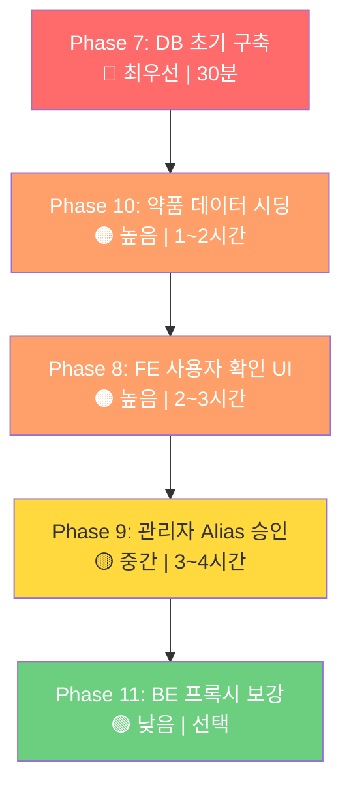

# OCR 복약관리 — 향후 과제 로드맵

> **기준일**: 2026-04-28  
> **환경**: 로컬 MySQL (127.0.0.1:3306 / silverlink)

---

## 현재 완료 상태

| 영역 | 상태 | 비고 |
|------|------|------|
| AI 파이프라인 (Phase 1~6) | ✅ | 37 tests passed |
| DB 스키마 (`schema.sql`) | ✅ | 54개 테이블 (AI 7개 포함) |
| AI API 엔드포인트 | ✅ | `validate-medication`, `confirm-medication`, `pending-confirmations` |
| FE OCR 페이지 | ✅ | `SeniorOCR.tsx` (44KB) |

---

## Phase 7: 로컬 DB 초기 구축

> **우선순위**: 🔴 최우선 (다른 모든 작업의 전제조건)  
> **예상 소요**: 30분

### 7-1. MySQL 테이블 생성

```bash
# 로컬 MySQL에 schema.sql 실행
mysql -u root -p silverlink < BE/SilverLink-BE/schema.sql
```

> [!IMPORTANT]
> `schema.sql`은 `IF NOT EXISTS`를 사용하므로 기존 테이블이 있어도 안전합니다.  
> 단, 컬럼 변경이 있는 경우 기존 테이블을 DROP 후 재실행해야 합니다.

### 7-2. AI `.env` 설정 확인

```env
# AI/SilverLink-AI/.env
RDS_HOST=localhost
RDS_PORT=3306
RDS_USER=root
RDS_PASSWORD=<your_password>
RDS_DATABASE=silverlink
```

### 7-3. e약은요 API 약품 데이터 시딩

```bash
# 1. medications_master에 약품 데이터 적재
cd AI/SilverLink-AI
python -m scripts.seed_medications

# 2. alias/error_alias 자동 생성
python -m scripts.seed_aliases
```

> [!NOTE]
> `seed_medications` 스크립트가 없다면 신규 작성 필요.  
> 식약처 e약은요 API (`https://apis.data.go.kr/1471000/DrbEasyDrugInfoService`)에서  
> 약품 정보를 가져와 `medications_master`에 INSERT합니다.

### 7-4. 검증

```bash
# 테이블 생성 확인
mysql -u root -p -e "USE silverlink; SHOW TABLES LIKE 'medication%';"

# 약품 데이터 확인
mysql -u root -p -e "USE silverlink; SELECT COUNT(*) FROM medications_master;"

# AI 서버 기동 후 파이프라인 테스트
cd AI/SilverLink-AI
uvicorn app.main:app --reload --port 8000
# → POST http://localhost:8000/api/ocr/validate-medication
```

---

## Phase 8: FE 사용자 확인 UI

> **우선순위**: 🟠 높음  
> **예상 소요**: 2~3시간  
> **관련 파일**: `FE/SilverLink-FE/src/pages/senior/SeniorOCR.tsx`

### 현재 상태
- `SeniorOCR.tsx` (44KB)에 OCR 촬영 + 결과 표시 화면이 이미 존재
- `decision_status`, `match_confidence`, `requires_user_confirmation` 필드 FE 연동 완료

### 구현 필요 사항

#### 8-1. 후보 선택 확인 모달
사용자가 `NEED_USER_CONFIRMATION` 또는 `AMBIGUOUS` 상태일 때:

```
┌────────────────────────────────┐
│  약을 확인해주세요              │
│                                │
│  📸 OCR 원문: "타이레놀정500mg" │
│                                │
│  [후보 1] 타이레놀정 500mg ✅   │
│   - 일치도: 92.3%              │
│   - 매칭: exact match          │
│                                │
│  [후보 2] 타이레놀ER서방정      │
│   - 일치도: 71.5%              │
│   - 매칭: alias match          │
│                                │
│  [후보 3] 직접 입력...          │
│                                │
│  [확인]        [아닌 약이에요]   │
└────────────────────────────────┘
```

#### 8-2. 미확인 목록 알림 배지

```tsx
// SeniorDashboard.tsx 또는 SeniorMedication.tsx에 추가
// GET /api/ocr/pending-confirmations/{elderlyUserId}
// → 미확인 건수를 배지로 표시
```

#### 8-3. API 연동

| API | 용도 | FE 호출 시점 |
|-----|------|-------------|
| `POST /ocr/confirm-medication` | 후보 확정/거부 | 모달에서 [확인] 또는 [아닌 약이에요] 클릭 |
| `GET /ocr/pending-confirmations/{id}` | 미확인 목록 | 대시보드 진입 시, 알림 탭 |

#### 8-4. 요청 페이로드

```json
// POST /ocr/confirm-medication
{
  "request_id": "uuid-from-ocr-result",
  "selected_item_seq": "200003352",
  "confirmed": true
}
```

---

## Phase 9: 관리자 Alias 승인 UI

> **우선순위**: 🟡 중간  
> **예상 소요**: 3~4시간  
> **관련 파일**: 신규 생성 필요

### 9-1. BE API 추가 (Spring Boot)

| 메서드 | 경로 | 설명 |
|--------|------|------|
| `GET` | `/api/admin/alias-suggestions` | PENDING 제안 목록 (페이징) |
| `PUT` | `/api/admin/alias-suggestions/{id}/approve` | 승인 → `medication_aliases`에 등록 |
| `PUT` | `/api/admin/alias-suggestions/{id}/reject` | 거부 |

> [!IMPORTANT]
> 승인 시 트랜잭션:
> 1. `medication_alias_suggestions.review_status` → `APPROVED`, `is_active` → 1
> 2. `medication_aliases`에 INSERT (또는 `medication_error_aliases`)
> 3. `suggestion_type`에 따라 대상 테이블 분기

### 9-2. FE 관리자 페이지

```
FE/SilverLink-FE/src/pages/admin/
└── AdminAliasSuggestions.tsx (신규)
```

```
┌─────────────────────────────────────────────┐
│  Alias 제안 관리                    [필터 ▼] │
│                                             │
│  ┌─────────────────────────────────────────┐│
│  │ #1 | "타이레넬" → 타이레놀정500mg       ││
│  │     빈도: 12회 | 출처: user_feedback    ││
│  │     유형: error_alias                   ││
│  │     [승인] [거부]                       ││
│  ├─────────────────────────────────────────┤│
│  │ #2 | "게보린정" → 게보린정              ││
│  │     빈도: 5회 | 출처: ocr_learning      ││
│  │     유형: alias                         ││
│  │     [승인] [거부]                       ││
│  └─────────────────────────────────────────┘│
│                                             │
│  ◀ 1 2 3 ▶                                 │
└─────────────────────────────────────────────┘
```

### 9-3. 승인 후 LocalDrugIndex 갱신

```python
# AI 서버 재기동 시 자동 로딩
# 또는 관리자 승인 API 호출 시 AI 서버에 reload 이벤트 전송
POST /api/ocr/reload-dictionary  # 신규 엔드포인트
```

---

## Phase 10: e약은요 약품 데이터 시딩 스크립트

> **우선순위**: 🟠 높음 (Phase 7의 전제)  
> **예상 소요**: 1~2시간

### 10-1. `scripts/seed_medications.py` 신규 작성

```python
"""
e약은요 API에서 약품 정보를 가져와 medications_master에 적재.

Usage:
    python -m scripts.seed_medications --page-size 100 --max-pages 50
    
API: https://apis.data.go.kr/1471000/DrbEasyDrugInfoService/getDrbEasyDrugList
필요: DRUG_API_SERVICE_KEY 환경변수
"""
```

#### 핵심 로직

```
1. API 호출 (pageNo 순회)
2. 응답 파싱 → DrugInfo 모델
3. item_name_normalized 생성 (TextNormalizer 활용)
4. medications_master에 UPSERT (ON DUPLICATE KEY UPDATE)
5. 적재 건수 로깅
```

#### 매핑

| API 응답 필드 | DB 컬럼 |
|--------------|---------|
| `itemSeq` | `item_seq` |
| `itemName` | `item_name` |
| `entpName` | `entp_name` |
| `efcyQesitm` | `efcy_qesitm` |
| `useMethodQesitm` | `use_method_qesitm` |
| `atpnQesitm` | `atpn_qesitm` |
| `intrcQesitm` | `intrc_qesitm` |
| `seQesitm` | `se_qesitm` |
| `depositMethodQesitm` | `deposit_method_qesitm` |
| `itemImage` | `item_image` |

### 10-2. 실행 순서

```bash
# 1단계: 약품 마스터 적재
python -m scripts.seed_medications

# 2단계: alias/error_alias 자동 생성 (기존 스크립트)
python -m scripts.seed_aliases

# 3단계: LocalDrugIndex 확인
# AI 서버 기동 시 medication_dictionary_load_logs에 로딩 결과 기록
```

---

## Phase 11: Spring Boot BE 프록시 보강 (선택)

> **우선순위**: 🟢 낮음 (AI 직접 호출 가능하면 후순위)  
> **예상 소요**: 2~3시간

### 현재 구조

```
FE → Spring Boot (BE) → FastAPI (AI)
                ↓
           MySQL (공유)
```

### 보강 포인트

| 항목 | 설명 |
|------|------|
| `confirm-medication` 프록시 | BE가 AI의 confirm API를 프록시하여 인증/권한 체크 추가 |
| `pending-confirmations` 프록시 | 동일 |
| `medication_ocr_logs` ↔ `medication_ocr_results` 연결 | BE의 OCR 로그와 AI의 결과를 `request_id`로 조인 |

---

## 실행 순서 요약



---

## DB 접속 정보 (로컬)

| 항목 | 값 |
|------|---|
| Host | `127.0.0.1` (localhost) |
| Port | `3306` |
| Database | `silverlink` |
| User | `root` |
| Charset | `utf8mb4` |
| Collation | `utf8mb4_unicode_ci` |

### AI `.env` 설정

```env
RDS_HOST=localhost
RDS_PORT=3306
RDS_USER=root
RDS_PASSWORD=<비밀번호>
RDS_DATABASE=silverlink
```

### BE `application.yml` 설정

```yaml
spring:
  datasource:
    url: jdbc:mysql://localhost:3306/silverlink?useSSL=false&characterEncoding=utf8mb4&serverTimezone=Asia/Seoul
    username: root
    password: <비밀번호>
    driver-class-name: com.mysql.cj.jdbc.Driver
```
